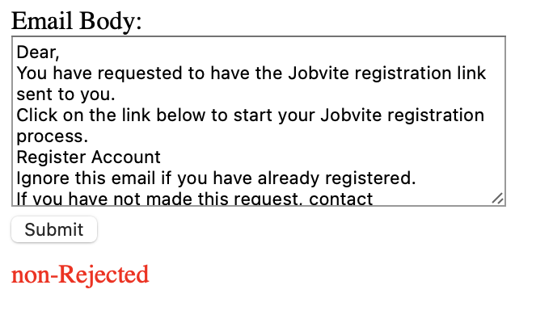
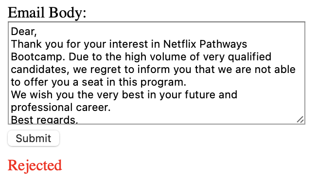
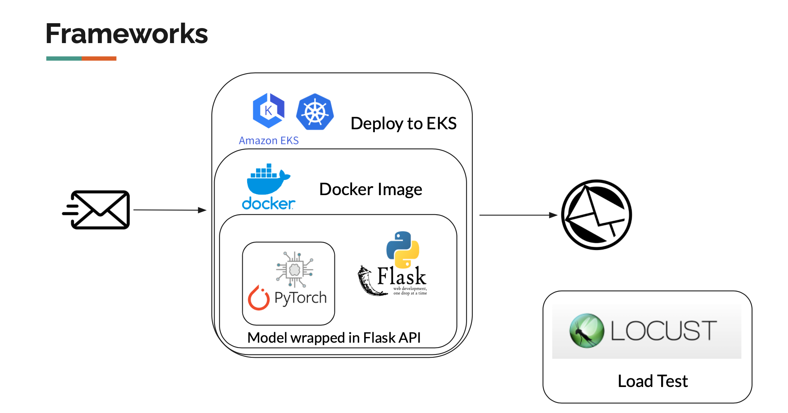

# Rejection Letter Detection
This is a microservice that can recognize and reject emails. It uses an NLP-based spam classification model, trained on rejection letters, and achieves over 90% accuracy.

### Demo Video
https://drive.google.com/file/d/18YgrAxT73_PZ8kd3Prs1lj1QNDLBToKK/view?usp=sharing






### Frameworks
* flask
* pandas
* scikit-learn
* joblib
* torch




### Quick Start

#### Install
```
docker run -p7890:5000 brandon233/rejection-letter-detection:tagname
```

#### Access
web: 
```
http://localhost:7890/
```

terminal: 
```
curl -X POST -d "text-input=Hello, unfortunately..." http://localhost:7890/api
```


### References:

Training Data: https://www.kaggle.com/datasets/sethpoly/application-rejection-emails

Model: https://www.kaggle.com/datasets/datatattle/email-classification-nlp


